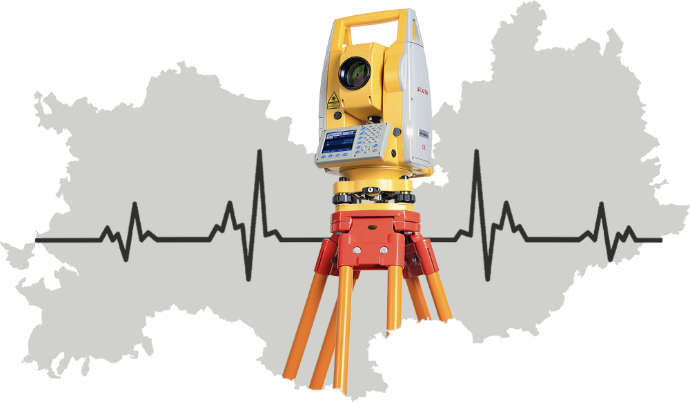
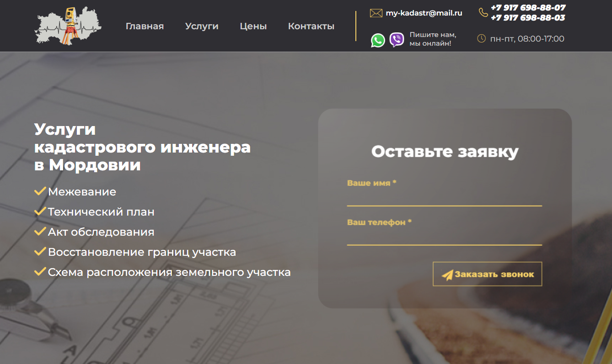
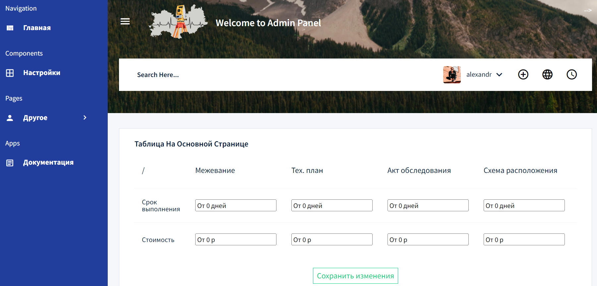
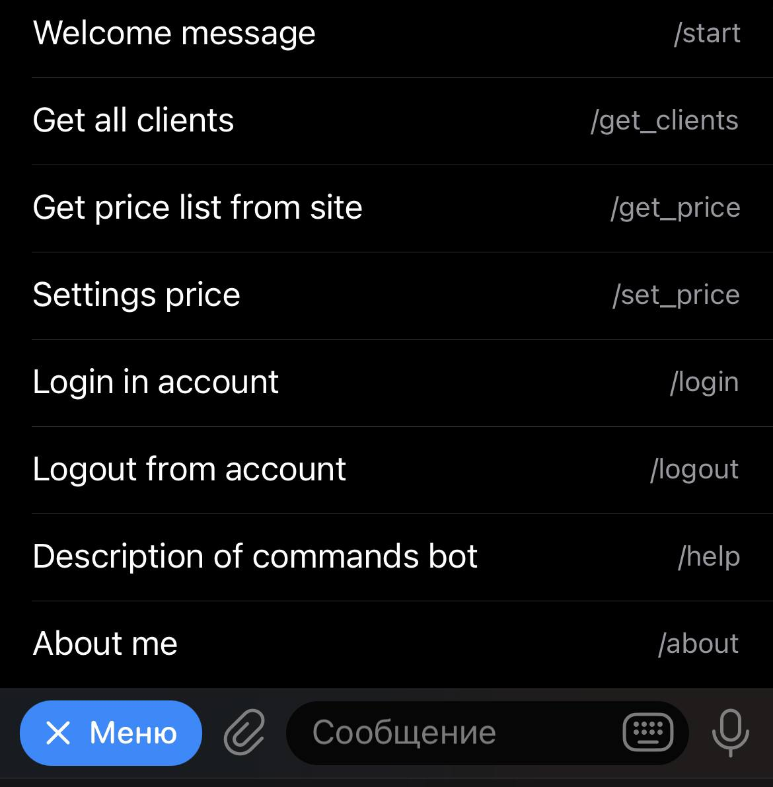
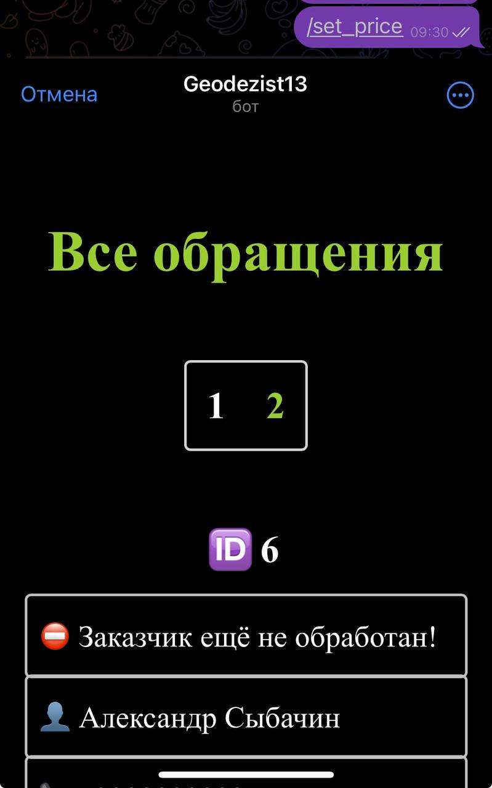
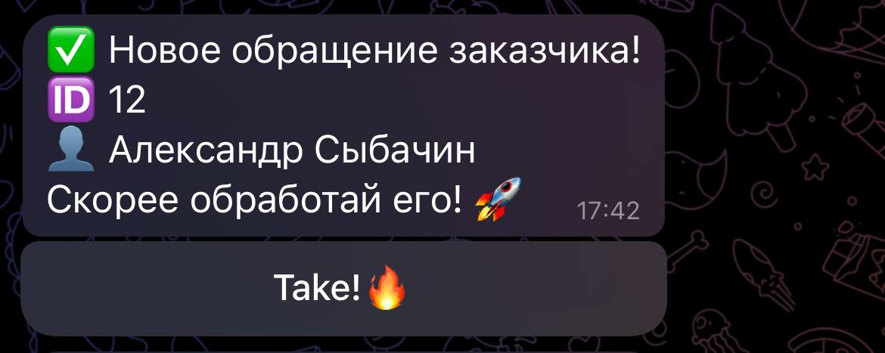
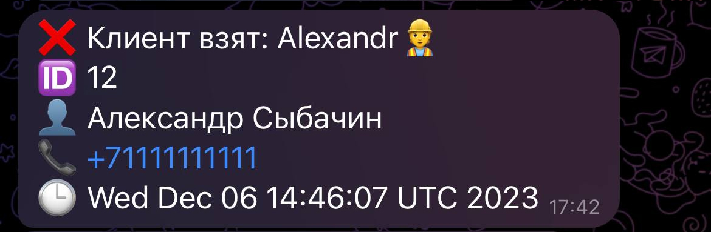

# <a href="https://my-kadastr.ru">   My-kadastr.ru </a>
Данный проект является продуктом, сайтом кадастровых инженеров в Республике Мордовии.

По совместительству это мой *первый проект* в качестве Web разработки. В нем я впервые познакомился со Spring Framework.
## Description project
Проект состоит из 3х микросервисов: 
+ [DBPostgres](#Description-DBPostgres)
+ [Site](#Description-Site)
+ [TgBot2](#Description-TgBot2)

Все микросервисы общаются между собой с помощью API запросов и RabbitMQ.
+ ## Description DBPostgres
    Данный микросервис выполняет роль связующего звена с базой данных. Он принимает запросы с других микросервисов и отдаёт им запрашиваемые данные.

+ ## Description Site

    Главной задачей микросервиса является показ сайта для пользователей и обработка данных администраторами. На самом сайте пользователь может ознакомиться с предоставляемыми услугами инженеров, прайс листом, а также может оставить заявку, чтобы ему перезвонили.

    На сайте кроме основной страницы существует страница для авторизированных пользователей, админ панель. В админ панели можно редактировать прайс лист ~~(который динамически отрисовывается)~~, поменять пароль, а так же обработать обращение клиента и посмотреть все обращения. Для корректного вывода данных о клиентах применяется пагинация.

    >**
Пример страницы в админ панели**
    >

    Сайт защищен с помощью **Spring Security**. В качестве сессий используется подход основанный на *Cookies*.

+ ## Description TgBot2
    Данный микросервис отвечает за работу телеграм бота. Телеграм бот предназначен для администраторов. Его функционал полностью аналогичен админ панели.

    >**
Все команды бота**
    >

    Для удобства пользования телеграм ботом в неё используется технология WebApp, для которой отдельно написан front.
    > 
 Пример как выглядит UI WebApp
    > 

    **Главным преимуществом телеграм бота** по сравнению с админ панелью является его мобильность. Когда приходит новое обращение от клиента, телеграм бот сразу же уведомляет об этом всех администраторов (всех инженеров), которые вошли в свой аккаунт через телеграм.

    >**
Уведомление о новом клиенте до взятия**
    >

    После того как инженер берёт в обращение клиента, у него и у всех остальных инженеров меняется сообщение: выдаётся номер клиента, кто его взял и когда его взял.

    >**
Уведомление о новом клиенте после взятия**
    >

## Technologies
- Apache Maven
- Docker
- Git
- Hibernate
- PostgreSQL
- Java
- JavaScript
- Nginx
- Let's Encrypt
- HTML/CSS
- RabbitMQ
- Spring Framework
- Telegram API

# Ссылка на сайт 
https://my-kadastr.ru